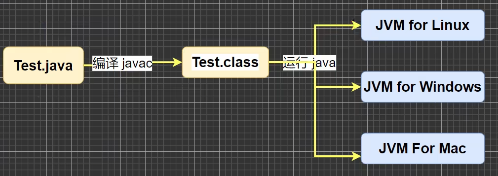
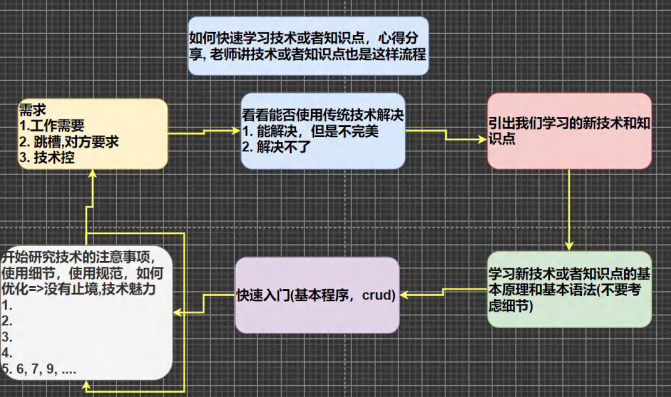
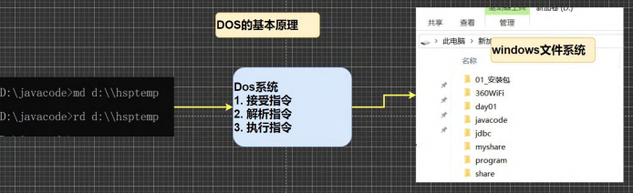
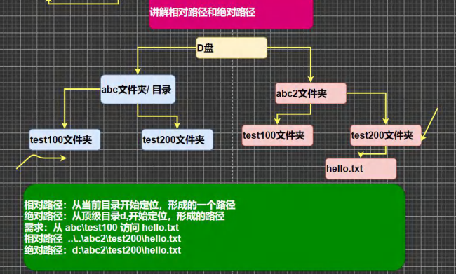
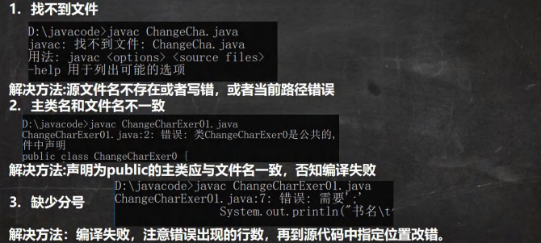
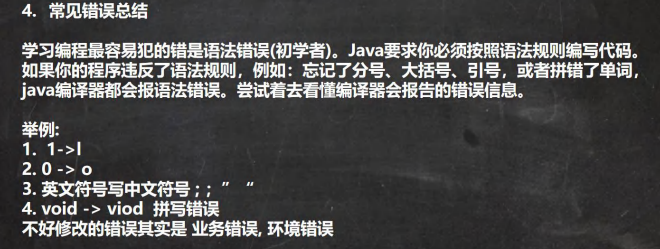
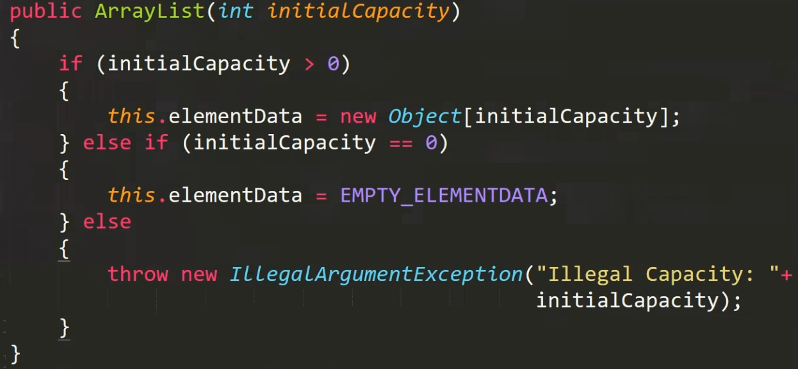
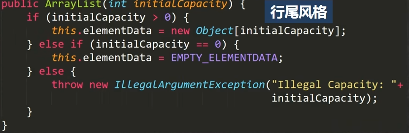
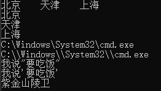
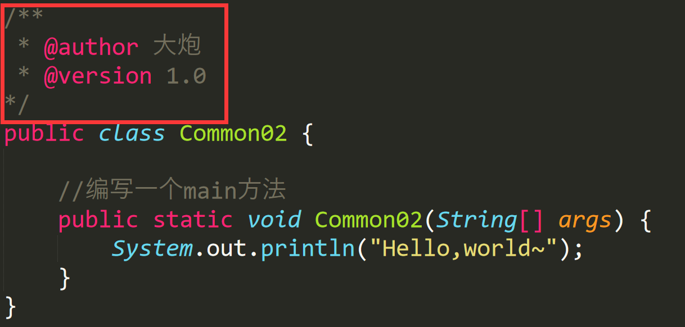

# Java基础学习plus


# ·什么是运行

1.有了可执行的java程序（Hello.class字节码文件）

2.通过运行工具java.exe对字节码文件进行执行，本质就是.class文件装在到JVM机执行


# ·Java程序开发注意事项

对修改后的Hello.java源文件需要重新编译，生成新的class文件后，再进行执行，才能生效


# ·什么是JDK、JRE

* JDK、JRE和JVM的包含关系
* 1. JDK = JRE + 开发工具集（例如javac，java编译工具等）
  2. JRE = JVM + Java SE标准类库（Java核心类库）
  3. JDK = JVM+ Java SE标准类库 + 开发工具集
  4. 代码开发人员需要安装JDK
  5. 如果只需要运行开发好的.class文件，只需要安装JRE




# ·Java执行流程分析

.java文件（源文件）==>javac编译==>.class文件（字节码文件）==>java运行==>结果


# ·如何快速学习技术或者知识点




crud: 增删改查


#  ·Java开发注意事项和细节说明


1.Java源文件以.java为扩展名。源文件的基本组成部分是类(class)，如本类中的Hello类。

2.Java应用程序的执行入口是main()方法。它有固定的书写格式:

```
public static void main(String[] args) {
		System.out.println("Hello,world~");
		}
```

3.Java语言严格区分大小写。

4.Java方法由一条条语句构成，每个语句以“;”结束。

5.大括号都是成对出现的，缺一不可。

6.一个源文件中最多只能有一个public类。其它类的个数不限。

7.如果源文件包含一个public类，则文件名必须按该类名命名!

8.一个源文件中最多只能有一个public类。其它类的个数不限，也可以将main方法写在非public类中，然后指定运行非public类，这样入口方法就是非public的main方法


# ·DOS了解

## DOS介绍

DOS：Disk Operating System 磁盘操作系统

## 基本原理




## 相互路径和绝对路径




## 常用的DOS命令

1. 查看当前目录里有什么

​		dir    dir d:\abc\abc2\test200

2. 切换到其他的盘下

   cd /D c:      

3. 切换到当前盘的其他目录下

   绝对路径  cd d:\abc\abc2\test200

   相对路径  

   ```
   cd ..\..abc2\test200
   ```

4. 切换到上一级

   cd ..

5. 切换到根目录

   cd \

6. 查看当前文件夹下的所有子目录

   tree 文件夹名

7. 清屏

   cls

8. 退出dos

   exit


# ·初学者易犯的错误






# ·Java代码规范

1.  类、方法的注释，要以javadoc的方式来写

2.  非javadoc的注释，往往是非代码的维护者看的，着重告诉读者为什么这样写，如何修改，注意什么问题等

3.  使用tab的操作，实现缩进，默认整体向右移动，使用shift+tab，实现整体向左移动

4.  运算符和=两边习惯性加上一个空格

5.  源文件使用utf-8编码，在传统的dos窗口里，才设置为gbk编码

6.  行宽度不要超过80字符

7.  代码编写次行风格和行尾风格

​		a.次行风格



​		b.行尾风格




# ·Java转义字符


\t ：一个制表位，实现对其的功能

\n ：换行符

\\\ ：一个\

\\" ：一个“

\\'  ：一个’

\r ：一个回车


## 代码示例

```
//演示转义字符的使用
public class ChangeChar {

	//编写一个main方法
	public static void main(String[] args) {
		System.out.println("北京\t天津\t上海");
        // \t实现制表位对齐
		System.out.println("北京\n天津\n上海");
		// \n实现换行
		System.out.println("C:\\Windows\\System32\\cmd.exe");
		System.out.println("C:\\\\Windows\\\\System32\\\\cmd.exe");
		// \\ : 一个\
		System.out.println("我说\"要吃饭\"");
		// \" : 一个"
		System.out.println("我说\'要吃饭\'");
		// \" : 一个'
		System.out.println("南京孝陵卫\r紫金山");
		// \r : 一个回车
		// \r将光标移至当前行的最前端，用\r后面的字符依次代替
	}
}
```

## 运行结果




# 练习

编写代码，用一个输出语句实现以下的输出结果


### 代码如下

```
public class ChangeCharEx {

	//编写一个main方法
	public static void main(String[] args) {
		System.out.println("D:\\javacode>java Test\n书名\t作者\t价格\t销量\n三国\t罗贯中\t120\t1000");

		
	}
}
```


# ·注释


## 介绍

用于注解说明解释程序的文字就是注释，注释提高了代码的阅读性


## Java中常见的注释类型

1、单行注释

格式：//注释文字

2、多行注释

格式：/*注释文字 

注释文字 */

*注意：多行注释里不可以嵌套多行注释*

3、文档注释

注释内容可以被JDK提供的工具javadoc所解析，生成一套以网页文件形式体现的该程序的说明文档，一般写在类

## 		基本格式如下



## 		终端运行语句

```
javadoc -d E:\Graduate_Student\Java学习\temp -author -version Common02.java
```

其中的-author和-version是javadoc标签，在实际工作中还有很多其他的javadoc标签


